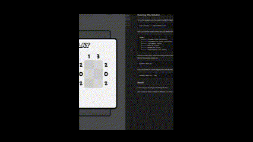

# Domino Fit Solver

This is a simple solver (with UI) for the game [Domino Fit](https://dominofit.isotropic.us/)

### Game Background:
The game is quite simple. You place dominos on a board so that the sum of all rows and columns equal that of given row and column values. Locations on the board can be blocked off, meaning they cannot be filled in with any domino. If you solve the puzzle without placing any incorrect dominos then you get the "wizardly" title for that puzzle.

## Approaches

When trying to solve this problem there are three approaches immediately apparent to solve the game programmatically:

1) Describe this problem as series of satisfiability formulas and use a SAT solvers
2) Brute force the problem and backtrace whenever one reaches an invalid state
3) Use a combination of the two above. That is, use more advanced logic rules to generate known good domino locations and then brute force with backtracking.

## This solution
This solution uses the backtracking approach for two reasons.

1) After brief Googling, it appears no one else has implemented the backtracking solution.
2) It is more intuitive of how a person might solve the problem sans knowing anything except whether a state of the problem is valid or invalid.


## Tools Used

I used Selenium for the UI. This gives both the animation of the problem being solved and the ability to not have to manually input the row counts, column counts, and blocked board locations. I chose to use the Chrome WebDriver for Linux. The code should work with any browser, but you may need to change some of the code if you use something different. The solution is written in Python 3.


## Running This Solution
To run the program, you first need to install the dependency. For simplicity this can be done with:
```
pip3 install -r requirements.txt
```

Next, you need to install Chrome and your WebDriver (this varies by machine and OS), but in the end, your directory structure should something like:

```
<home>
  ├────── /chrome-linux (directory)
  ├────── /chromedriver-linux (directory)
  ├────── .gitignore (file)
  ├────── main.py (file)
  ├────── README.md (file)
  ├────── requirements.txt (file)
  └────── solve.gif (file)
```

To then run the solver, which solves the puzzles in the background and then place only correct dominos to the board (this gives you the "wizardly" title for the puzzle), simply run:
```
python3 main.py
```

If you would like to include logging then add the flag `--log`, that is, run the command:
```
python3 main.py --log
```

## Result

In the end you should get something like this:



(Your problems will most likely be different since they change every day.)